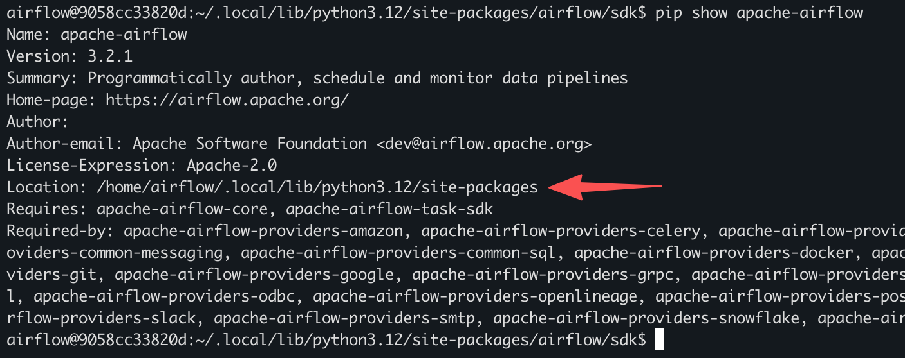
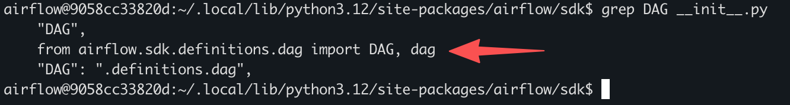

# airflow 学习
## airflow dag
- 默认部署在 ${AIRFLOW_HOME}/dags

## python 相关
### 查看airflow相关代码 
#### 确定airflow的库/包目录
```shell
pip show apache-airflow
```


#### 确定相关类的（如DAG类）定义
1. 从 代码`from airflow.sdk import DAG` 确定基本目录为`airflow/sdk`
2. 有的类定义直接在目录下，有的会进行封装，这时查看 __init__.py 确定类定义文件（这样设计的好处是保持API的统一和简洁）
