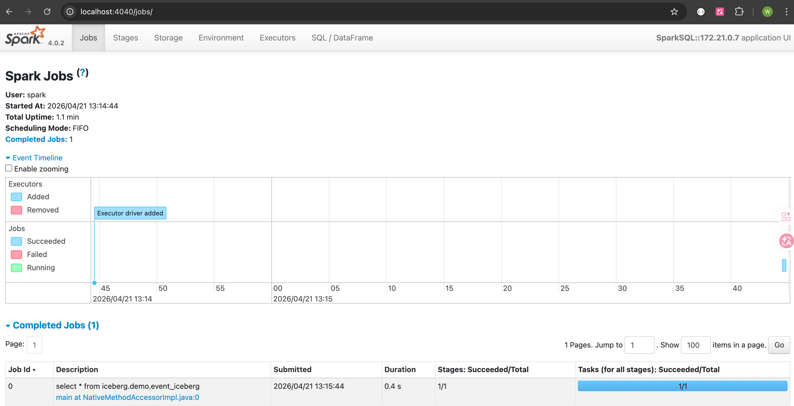

# 使用Spark read Iceberg & Kafka

## Read Iceberg

### Spark 部署模式
- Local
- Standalone
- Yarn
- K8S

### 启动spark-sql
```shell
./bin/spark-sql --master spark://spark:7077
```

### 提交sql
```sql
-- 第一次看不到iceberg（懒加载）
show catalogs;

-- 语法同Trino
show schemas from iceberg;
select * from iceberg.demo.event_kafka;
```

### 查看任务执行细节
启动 ./bin/spark-sql 或者 ./bin/pyspark 后，都可以访问[Spark Web UI](http://localhost:4040) 查看Application执行细节
