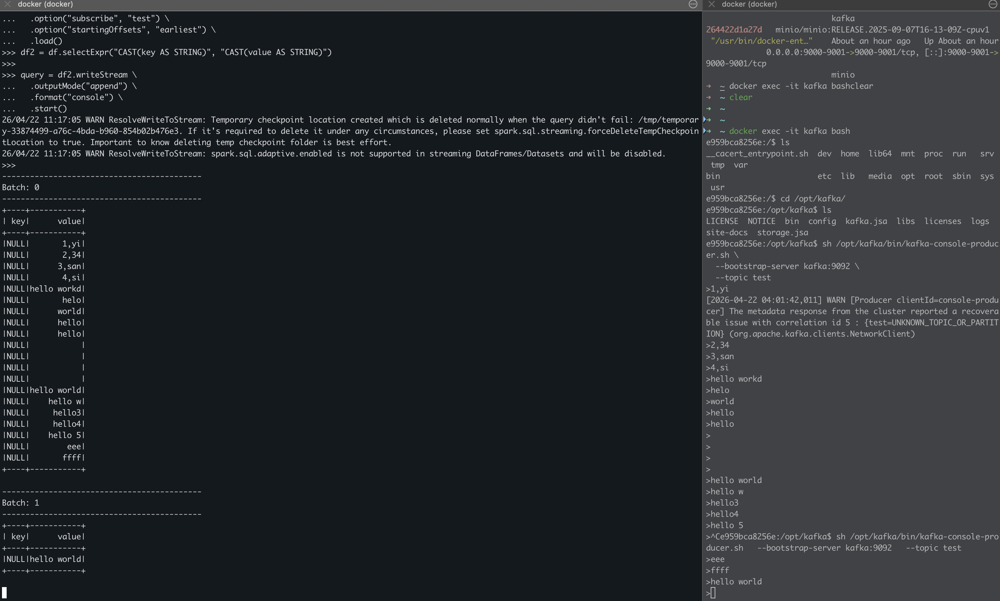

# 使用Spark read Iceberg & Kafka

## Read Iceberg

### Spark 部署模式
- Local
- Standalone
- Yarn
- K8S

### 启动spark-sql
```shell
./bin/spark-sql --master spark://spark:7077
```

### 提交sql
```sql
-- 第一次看不到iceberg（懒加载）
show catalogs;

-- 语法同Trino
show schemas from iceberg;
select * from iceberg.demo.event_kafka;
```

### 查看任务执行细节
启动 ./bin/spark-sql 或者 ./bin/pyspark 后，都可以访问[Spark Web UI](http://localhost:4040) 查看Application执行细节


## Read Kafka
### 启动pySpark
```shell
./bin/pyspark --master spark://spark:7077
```

### 查询kafka数据
```python
df = spark.readStream.format("kafka") \
  .option("kafka.bootstrap.servers", "kafka:9092") \
  .option("subscribe", "test") \
  .option("startingOffsets", "earliest") \
  .load()

df2 = df.selectExpr("CAST(key AS STRING)", "CAST(value AS STRING)")

query = df2.writeStream \
  .outputMode("append") \
  .format("console") \
  .start()

query.awaitTermination()
```



## from kafka to iceberg (成功写入S3，但show tables无法显示)
```shell
./bin/spark-submit /tmp/kafka_to_iceberg.py
```